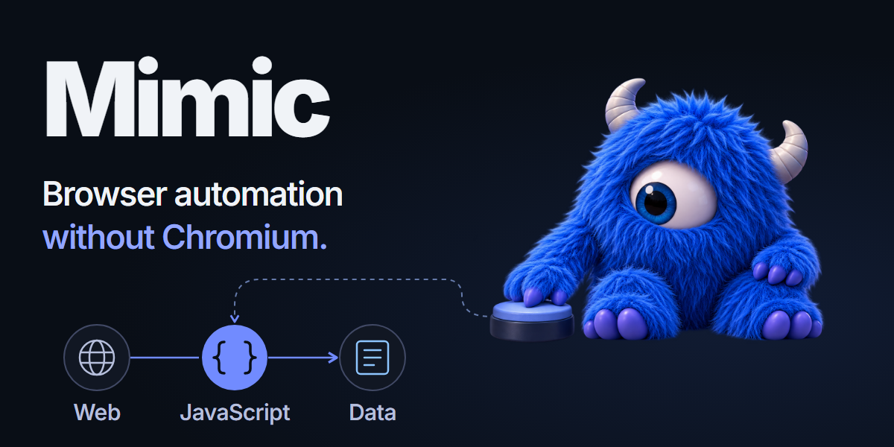

<p align="center">
  
</p>

<p align="center">
  <strong>Lightweight browser automation without Chromium.</strong><br>
  JavaScript automation and web scraping with Playwright, Puppeteer and CDP.
</p>

<p align="center">
  <a href="https://github.com/mimic-browser/runtime/releases/latest"></a>
  <a href="go.mod"></a>
  <a href="docs/getting-started.md"></a>
  <a href="docs/cdp-compatibility.md"></a>
</p>

<p align="center">
  <a href="#quick-start">Quick start</a> ·
  <a href="#benchmarks">Benchmarks</a> ·
  <a href="https://github.com/mimic-browser/runtime/releases/latest">Download</a> ·
  <a href="docs/getting-started.md">Documentation</a> ·
  <a href="docs/cdp-compatibility.md">CDP support</a>
</p>

Mimic runs browser automation without a Chromium process. It loads pages, executes
JavaScript in V8, and exposes DOM, CSS, navigation and page state over CDP. It is
built for extraction and automation where browser behavior matters but pixels do not.

**Use the tools you know.** The [Mimic SDK](https://github.com/mimic-browser/sdk)
manages the runtime and works alongside real Playwright, Puppeteer and other
framework objects. You can also start the binary yourself and connect with an
ordinary CDP client.

For interactive DOM/CSS editing, Console and Network inspection, connect
[Chrome DevTools](docs/devtools.md). Inspection uses canonical runtime state
without an external browser. Visual page presentation is unsupported.

## Quick start

Install the SDK from npm with the Playwright client used in this example:

```sh
npm install mimic-browser playwright-core@1.63.0
```

Requires Node.js 22.19 or newer. Save this as `scrape.mjs` and run it with
`node scrape.mjs`:

```javascript
import { launch } from "mimic-browser/playwright";

const session = await launch();
try {
  const context = await session.newContext();
  const page = await context.newPage();
  await page.goto("https://example.com");
  console.log(await page.title());
} finally {
  await session.close();
}
```

The first launch downloads a verified runtime for supported Windows x64 or
Linux x64 hosts; later launches reuse the persistent local cache. No Chromium
installation or manual executable path is needed. Playwright and Puppeteer are
optional clients: choose the one your project uses.

For Python, C#, Java, Kotlin, Go, Rust, Ruby or PHP, choose your language and
client in the [SDK quickstart](https://mimic.boo/sdk/). It includes installation
commands and runnable launch/connect examples for each integration.

### Bring your own CDP client

[Download the standalone binary](https://github.com/mimic-browser/runtime/releases/latest)
and start its local endpoint (`mimic.exe` on Windows):

```sh
./mimic -listen 127.0.0.1:9222
```

Connect through Playwright’s `chromium.connectOverCDP()`, Puppeteer’s
`puppeteer.connect()`, or another CDP client. No SDK is required for this path.
See the [direct Playwright example](examples/playwright.mjs) and
[CDP support](docs/cdp-compatibility.md).

## Built for repeated work

Run independent Pages concurrently, use your own proxies and Contexts, and
keep familiar automation code. For a repeatable workload, `mimic optimize` can
learn a reusable resource profile from your existing assertions:

```sh
mimic optimize --name shop -- node scraper.js
mimic --profile shop
```

[How Optimize works](docs/optimize/index.md) ·
[Runnable examples](examples/README.md) ·
[Profile and proxy options](docs/environment-profiles.md)

## Benchmarks

The October 10, 2026 memory checkpoint used **9.30× less ready RSS**
(40.80 vs. 379.54 MiB) and **5.64× less active RSS** at 50 static Pages
(727.78 vs. 4,102.04 MiB), compared with saved September 29 Chrome 152
measurements on the same machine. All 120 measured single-Page attempts passed.
Static and CPU completed 100-Page series; React completed 50 Pages. The React-100
series failed in its last wave (native access violation) and is excluded from
successful memory comparisons; 2,810 of 2,910 density attempts were valid.
This was a memory-only run; throughput and cold latency were not re-certified.
Snapshot bytecode clearing traded approximately 7% static batch throughput for
lower memory in a separate paired diagnostic.

[Current memory results and methodology](benchmark/runs/14-memory-20261010/public-summary.md) ·
[September full benchmark and throughput](benchmark/runs/13-rss-20260929/public-summary.md) ·
[Reproduce](benchmark/README.md) ·
[Current performance notes](docs/performance/report.md)

## Know the boundary

Mimic targets observable Chrome 152 behavior. It is a public beta with
workload-dependent compatibility. Mimic does not implement the full
Chromium/Web API surface. Test your workload against the
[compatibility notes](docs/compatibility.md); keep the
unauthenticated CDP endpoint on a trusted local interface.

[Getting started](docs/getting-started.md) ·
[Architecture](docs/architecture.md) ·
[Contributing](CONTRIBUTING.md) ·
[Website](https://mimic.boo)

## License

Mimic is source-available under the [Prosperity Public License 3.0.0](LICENSE).
Noncommercial use is free; commercial use has a 30-day trial.
Contributions require the [Mimic CLA](CLA.md).
